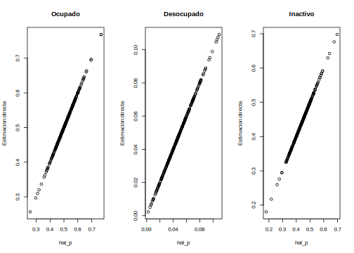
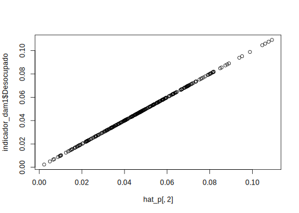
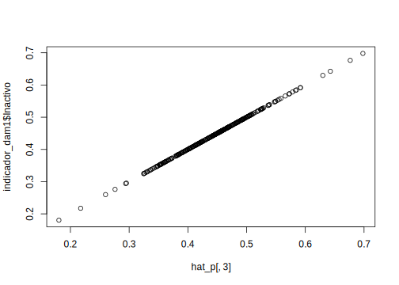
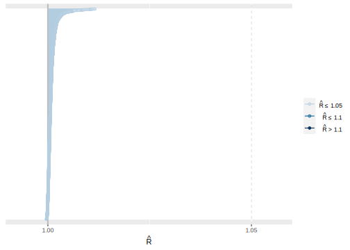
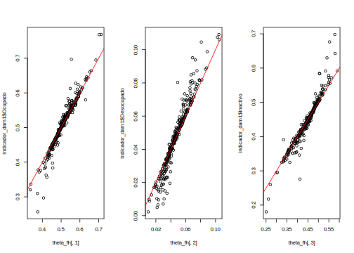

```r
knitr::opts_chunk$set(warning = FALSE, 
                      message = FALSE,
                      cache = TRUE)
library(kableExtra)
```

```
## Warning: package 'kableExtra' was built under R version 4.2.2
```

```r
tba <- function(dat, cap = NA){
  kable(dat,
      format = "html", digits =  4,
      caption = cap) %>% 
     kable_styling(bootstrap_options = "striped", full_width = F)%>%
         kable_classic(full_width = F, html_font = "Arial Narrow")
}
```

# Estimación del modelo de área de respuesta multinomial 

## Lectura de librerías 


```r
library(survey)
library(srvyr)
library(stringr)
library(magrittr)
library(ggplot2)
library(patchwork)
library(tidyverse)
library(cmdstanr)
library(bayesplot)
select <- dplyr::select
```

### Lectura de bases de datos


```r
indicador_dam <- readRDS('01 Modelo de area/CHL/2017/Data/base_modelo.Rds')
statelevel_predictors_df <- readRDS('01 Modelo de area/CHL/2017/Data/satelitales_media.rds')
```

## Estandarizando las variables para controlar el efecto de la escala. 


```r
statelevel_predictors_df %<>%
  mutate_if(is.numeric,
            function(x)as.numeric(scale(x)))
```

## Realizando ajuste sobre el deff estimado. 


```r
indicador_dam1 <- indicador_dam %>%
   mutate(
    id_orden = 1:n(),
    Ocupado_deff = ifelse(Ocupado_deff < 1, 1, Ocupado_deff),
    Desocupado_deff = ifelse(Desocupado_deff < 1, 1, Desocupado_deff),
    Inactivo_deff = ifelse(Inactivo_deff < 1, 1, Inactivo_deff)
  )
```

## Definición del modelo multinomial

-   Sea $K$ el número de categorías de la variable de interés $𝑌\sim multinimial\left(\boldsymbol{\theta}\right)$, con $\boldsymbol{\theta}=\left(p_{1},p_{2},\dots ,p_{k}\right)$ y $\sum_{k=1}^{K}p_{k}=1$.

-   Sea $N_i$ el número de elementos en el i-ésiamo dominio y $N_{ik}$ el número de elementos que tienen la k-ésima categoría, note que $\sum_{k=1}^{K}N_{ik}=N_{i}$ y $p_{ik}=\frac{N_{ik}}{N_{i}}$.

-   Sea $\hat{p}_{ik}$ la estimación directa de $p_{ik}$ y $v_{ik}=Var\left(\hat{p}_{ik}\right)$ y denote el estimador de la varianza por $\hat{v}_{ik}=\widehat{Var}\left(\hat{p}_{ik}\right)$


Note que el efecto diseño cambia entre categoría, por tanto, lo primero será definir el tamaño de muestra efectivo por categoría. Esto es:

La estimación de $\tilde{n}$ esta dado por $\tilde{n}_{ik} = \frac{(\tilde{p}_{ik}\times(1-\tilde{p}_{ik}))}{\hat{v}_{ik}},$

$\tilde{y}_{ik}=\tilde{n}_{ik}\times\hat{p}_{ik}$

luego, $\hat{n}_{i} = \sum_{k=1}^{K}\tilde{y}_{ik}$

de donde se sigue que $\hat{y}_{ik} = \hat{n}_i\times \hat{p}_{ik}$


Sea $\boldsymbol{\theta}=\left(p_{1},p_{2}, p_{3}\right)^{T}=\left(\frac{N_{i1}}{N_{i}},\frac{N_{i2}}{N_{i}}\frac{N_{i3}}{N_{i}}\right)^{T}$, entonces el modelo multinomial para el i-ésimo dominio estaría dado por:

$$
\left(\tilde{y}_{i1},\tilde{y}_{i2},\tilde{y}_{i3}\right)\mid\hat{n}_{i},\boldsymbol{\theta}_{i}\sim multinomial\left(\hat{n}_{i},\boldsymbol{\theta}_{i}\right)
$$ 
Ahora, puede escribir $p_{ik}$ como :

$\ln\left(\frac{p_{i2}}{p_{i1}}\right)=\boldsymbol{X}_{i}^{T}\beta_{2} + u_{i2}$ y
$\ln\left(\frac{p_{i3}}{p_{i1}}\right)=\boldsymbol{X}_{i}^{T}\beta_{3}+ u_{i3}$


Dada la restricción $1 = p_{i1} + p_{i2} + p_{i3}$ entonces 
$$p_{i1} + p_{i1}(e^{\boldsymbol{X}_{i}^{T}\boldsymbol{\beta_{2}}}+  u_{i2})+p_{i1}(e^{\boldsymbol{X}_{i}^{T}\boldsymbol{\beta}_{3}} + u_{i3})$$ de donde se sigue que 

$$
p_{i1}=\frac{1}{1+e^{\boldsymbol{X}_{i}^{T}\boldsymbol{\beta_{2}}}+ u_{i2}+e^{\boldsymbol{X_{i}}^{T}\boldsymbol{\beta_{2}}}+ u_{i3}}
$$

Las expresiones para $p_{i2}$ y $p_{i3}$ estarían dadas por: 

$$
p_{i2}=\frac{e^{\boldsymbol{X}_{i}^{T}\boldsymbol{\beta}_{2}} + u_{i2}}{1+e^{\boldsymbol{X}_{i}^{T}\boldsymbol{\beta_{2}}}+ u_{i2}+e^{\boldsymbol{X_{i}}^{T}\boldsymbol{\beta_{2}}}+ u_{i3}}
$$

$$
p_{i3}=\frac{e^{\boldsymbol{X}_{i}^{T}\boldsymbol{\beta}_{3}}+ u_{i3}}{1+e^{\boldsymbol{X}_{i}^{T}\boldsymbol{\beta_{2}}}+ u_{i2}+e^{\boldsymbol{X_{i}}^{T}\boldsymbol{\beta_{3}}}+ u_{i3}}
$$
dado la naturaleza de la variable, se puede suponer que $cor(u_{i2},u_{i3})\ne 0$

## Modelo programando en `STAN`


```r
functions {
  matrix pred_theta(matrix Xp, int p, matrix beta){
  int D1 = rows(Xp);
  real num1[D1, p];
  real den1[D1];
  matrix[D1,p] theta_p;
  
  for(d in 1:D1){
    num1[d, 1] = 1;
    num1[d, 2] = exp(Xp[d, ] * beta[1, ]' ) ;
    num1[d, 3] = exp(Xp[d, ] * beta[2, ]' ) ;
    
    den1[d] = sum(num1[d, ]);
  }
  
  for(d in 1:D1){
    for(i in 2:p){
    theta_p[d, i] = num1[d, i]/den1[d];
    }
    theta_p[d, 1] = 1/den1[d];
   }

  return theta_p  ;
  }
  
}

data {
  int<lower=1> D; // número de dominios 
  int<lower=1> P; // categorías
  int<lower=1> K; // cantidad de regresores
  int hat_y[D, P]; // estimaciones directa
  matrix[D, K] X_obs; // matriz de covariables
  int<lower=1> D1; // número de dominios no observados 
  matrix[D1, K] X_pred; // matriz de covariables para los no observados
}
  

parameters {
  matrix[P-1, K] beta;// matriz de parámetros 
  vector<lower=0>[P-1] sigma_u;       // random effects standard deviations
  // declare L_u to be the Choleski factor of a 2x2 correlation matrix
  cholesky_factor_corr[P-1] L_u;
  matrix[P-1, D] z_u;                  
}

transformed parameters {
  simplex[P] theta[D];// vector de parámetros;
  real num[D, P];
  real den[D];
  // this transform random effects so that they have the correlation
  // matrix specified by the correlation matrix above
  matrix[P-1, D] u; // random effect matrix
  u = diag_pre_multiply(sigma_u, L_u) * z_u;
  
  for(d in 1:D){
    num[d, 1] = 1;
    num[d, 2] = exp(X_obs[d, ] * beta[1, ]' + u[1, d]) ;
    num[d, 3] = exp(X_obs[d, ] * beta[2, ]' + u[2, d]) ;
    
    den[d] = sum(num[d, ]);
  }
  
  for(d in 1:D){
    for(p in 2:P){
    theta[d, p] = num[d, p]/den[d];
    }
    theta[d, 1] = 1/den[d];
  }
}

model {
  L_u ~ lkj_corr_cholesky(1); // LKJ prior for the correlation matrix
  to_vector(z_u) ~ normal(0, 10000);
  // sigma_u ~ cauchy(0, 50);
  sigma_u ~ inv_gamma(0.0001, 0.0001);
  
  for(p in 2:P){
    for(k in 1:K){
      beta[p-1, k] ~ normal(0, 10000);
    }
    }
  
  for(d in 1:D){
    target += multinomial_lpmf(hat_y[d, ] | theta[d, ]); 
  }
}

  
generated quantities {
  matrix[D1,P] theta_pred;
  matrix[2, 2] Omega;
  vector<lower=0>[2] sdcomprobar;
  sdcomprobar[1] = sd(u[1, ]);
  sdcomprobar[2] = sd(u[2, ]);

  Omega = L_u * L_u'; // so that it return the correlation matrix
  
 theta_pred = pred_theta(X_pred, P, beta);
}
```


## Identificando los municipios para predicción


```r
X_pred <- anti_join(statelevel_predictors_df,
                    indicador_dam1 %>% select(dam2))
```

Guardar el identificador de municipio a predecir. 


```r
X_pred %>% select(dam2) %>% 
  saveRDS(file = "01 Modelo de area/CHL/2017/Data/dam_pred.rds")
```

## Obteniendo la matriz


```r
X_pred %<>%
  data.frame() %>%
  select(-dam2)  %>%  as.matrix()
```

## Identificando los dominios para realizar estimación del modelo


```r
X_obs <- inner_join(indicador_dam1 %>% select(dam2, id_orden),
                    statelevel_predictors_df) %>%
  arrange(id_orden) %>%
  data.frame() %>%
  select(-dam2, -id_orden)  %>%  as.matrix()
```

## Identificando los argumentos para `STAN`


```r
D <- nrow(indicador_dam1)
P <- 3 # Ocupado, desocupado, inactivo.
Y_tilde <- matrix(NA, D, P)
n_tilde <- matrix(NA, D, P)
Y_hat <- matrix(NA, D, P)
```


```r
# n efectivos ocupado
n_tilde[,1] <- (indicador_dam1$Ocupado*(1 - indicador_dam1$Ocupado))/indicador_dam1$Ocupado_var
Y_tilde[,1] <- n_tilde[,1]* indicador_dam1$Ocupado


# n efectivos desocupado
n_tilde[,2] <- (indicador_dam1$Desocupado*(1 - indicador_dam1$Desocupado))/indicador_dam1$Desocupado_var
Y_tilde[,2] <- n_tilde[,2]* indicador_dam1$Desocupado

# n efectivos Inactivo
n_tilde[,3] <- (indicador_dam1$Inactivo*(1 - indicador_dam1$Inactivo))/indicador_dam1$Inactivo_var
Y_tilde[,3] <- n_tilde[,3]* indicador_dam1$Inactivo
```


```r
ni_hat = rowSums(Y_tilde)
Y_hat[,1] <- ni_hat* indicador_dam1$Ocupado
Y_hat[,2] <- ni_hat* indicador_dam1$Desocupado
Y_hat[,3] <- ni_hat* indicador_dam1$Inactivo
```

## Validación de los calculos


```r
hat_p <- Y_hat/rowSums(Y_hat)
plot(hat_p[,1],indicador_dam1$Ocupado)
```



```r
plot(hat_p[,2],indicador_dam1$Desocupado)
```



```r
plot(hat_p[,3],indicador_dam1$Inactivo)
```



### Correlación de las covariables y las estimaciones directas


```r
cor(hat_p,X_obs)
```

```
##      luces_nocturnas cubrimiento_cultivo cubrimiento_urbano modificacion_humana
## [1,]       0.4920297          -0.1208481          0.4484507           0.2943970
## [2,]       0.1401609          -0.1096543          0.1097744           0.1228389
## [3,]      -0.5400578           0.1549760         -0.4868899          -0.3347038
##      accesibilidad_hospitales accesibilidad_hosp_caminado
## [1,]               0.11274982                  0.09231100
## [2,]              -0.07645658                 -0.09435139
## [3,]              -0.09152536                 -0.06550775
```

Agregando el intercepto a la matrix de covariables


```r
X1_obs <- cbind(matrix(1,nrow = D,ncol = 1),X_obs)
K = ncol(X1_obs)
D1 <- nrow(X_pred)
X1_pred <- cbind(matrix(1,nrow = D1,ncol = 1),X_pred)
```

### Preparando argumentos para `STAN`


```r
sample_data <- list(D = D,
                    P = P,
                    K = K,
                    hat_y = Y_hat,
                    X_obs = X1_obs,
                    X_pred = X1_pred,
                    D1 = D1)
```

### Preparando el modelo en `STAN`


```r
fit2 <-
  cmdstan_model(stan_file = "01 Modelo de area/0funciones/01 Multinomial_simple_pred.stan",
                compile = TRUE)
```

### Ejecutando el modelo en `STAN`


```r
fit_mcmc2 <- fit2$sample(
  iter_sampling = 1000, 
  iter_warmup = 1000,
  data = sample_data,
  seed = 123,
  chains = 4,
  parallel_chains = 4
)
```

Guardando el modelo 

```r
fit_mcmc2$save_object(
  file = "01 Modelo de area/CHL/2017/Data/fit_multinomial_con_covariable.Rds")
```

leer el modelo previamente ejecutado 


```r
fit_mcmc2 <- readRDS("01 Modelo de area/CHL/2017/Data/fit_multinomial_con_covariable.Rds")
```

### Valores estimados para beta

```r
fit_mcmc2$summary("beta") %>% as.data.frame() %>% tba()
```

<table class="table table-striped lightable-classic" style="width: auto !important; margin-left: auto; margin-right: auto; font-family: Arial Narrow; width: auto !important; margin-left: auto; margin-right: auto;">
 <thead>
  <tr>
   <th style="text-align:left;"> variable </th>
   <th style="text-align:right;"> mean </th>
   <th style="text-align:right;"> median </th>
   <th style="text-align:right;"> sd </th>
   <th style="text-align:right;"> mad </th>
   <th style="text-align:right;"> q5 </th>
   <th style="text-align:right;"> q95 </th>
   <th style="text-align:right;"> rhat </th>
   <th style="text-align:right;"> ess_bulk </th>
   <th style="text-align:right;"> ess_tail </th>
  </tr>
 </thead>
<tbody>
  <tr>
   <td style="text-align:left;"> beta[1,1] </td>
   <td style="text-align:right;"> -2.4861 </td>
   <td style="text-align:right;"> -2.4855 </td>
   <td style="text-align:right;"> 0.0428 </td>
   <td style="text-align:right;"> 0.0437 </td>
   <td style="text-align:right;"> -2.5573 </td>
   <td style="text-align:right;"> -2.4174 </td>
   <td style="text-align:right;"> 1.0023 </td>
   <td style="text-align:right;"> 1019.1951 </td>
   <td style="text-align:right;"> 2598.776 </td>
  </tr>
  <tr>
   <td style="text-align:left;"> beta[2,1] </td>
   <td style="text-align:right;"> -0.1591 </td>
   <td style="text-align:right;"> -0.1595 </td>
   <td style="text-align:right;"> 0.0184 </td>
   <td style="text-align:right;"> 0.0183 </td>
   <td style="text-align:right;"> -0.1895 </td>
   <td style="text-align:right;"> -0.1280 </td>
   <td style="text-align:right;"> 1.0050 </td>
   <td style="text-align:right;"> 1324.1582 </td>
   <td style="text-align:right;"> 2640.008 </td>
  </tr>
  <tr>
   <td style="text-align:left;"> beta[1,2] </td>
   <td style="text-align:right;"> -0.0966 </td>
   <td style="text-align:right;"> -0.0963 </td>
   <td style="text-align:right;"> 0.0899 </td>
   <td style="text-align:right;"> 0.0895 </td>
   <td style="text-align:right;"> -0.2459 </td>
   <td style="text-align:right;"> 0.0518 </td>
   <td style="text-align:right;"> 1.0059 </td>
   <td style="text-align:right;"> 860.8015 </td>
   <td style="text-align:right;"> 1992.299 </td>
  </tr>
  <tr>
   <td style="text-align:left;"> beta[2,2] </td>
   <td style="text-align:right;"> -0.2346 </td>
   <td style="text-align:right;"> -0.2350 </td>
   <td style="text-align:right;"> 0.0391 </td>
   <td style="text-align:right;"> 0.0391 </td>
   <td style="text-align:right;"> -0.2990 </td>
   <td style="text-align:right;"> -0.1709 </td>
   <td style="text-align:right;"> 1.0083 </td>
   <td style="text-align:right;"> 1097.2804 </td>
   <td style="text-align:right;"> 1956.711 </td>
  </tr>
  <tr>
   <td style="text-align:left;"> beta[1,3] </td>
   <td style="text-align:right;"> -0.2137 </td>
   <td style="text-align:right;"> -0.2141 </td>
   <td style="text-align:right;"> 0.0509 </td>
   <td style="text-align:right;"> 0.0503 </td>
   <td style="text-align:right;"> -0.2981 </td>
   <td style="text-align:right;"> -0.1295 </td>
   <td style="text-align:right;"> 1.0044 </td>
   <td style="text-align:right;"> 816.9598 </td>
   <td style="text-align:right;"> 1888.151 </td>
  </tr>
  <tr>
   <td style="text-align:left;"> beta[2,3] </td>
   <td style="text-align:right;"> -0.0429 </td>
   <td style="text-align:right;"> -0.0430 </td>
   <td style="text-align:right;"> 0.0220 </td>
   <td style="text-align:right;"> 0.0221 </td>
   <td style="text-align:right;"> -0.0793 </td>
   <td style="text-align:right;"> -0.0066 </td>
   <td style="text-align:right;"> 1.0053 </td>
   <td style="text-align:right;"> 977.6790 </td>
   <td style="text-align:right;"> 1723.405 </td>
  </tr>
  <tr>
   <td style="text-align:left;"> beta[1,4] </td>
   <td style="text-align:right;"> -0.1609 </td>
   <td style="text-align:right;"> -0.1603 </td>
   <td style="text-align:right;"> 0.0748 </td>
   <td style="text-align:right;"> 0.0737 </td>
   <td style="text-align:right;"> -0.2829 </td>
   <td style="text-align:right;"> -0.0378 </td>
   <td style="text-align:right;"> 1.0053 </td>
   <td style="text-align:right;"> 1114.3069 </td>
   <td style="text-align:right;"> 2116.905 </td>
  </tr>
  <tr>
   <td style="text-align:left;"> beta[2,4] </td>
   <td style="text-align:right;"> 0.0145 </td>
   <td style="text-align:right;"> 0.0148 </td>
   <td style="text-align:right;"> 0.0324 </td>
   <td style="text-align:right;"> 0.0318 </td>
   <td style="text-align:right;"> -0.0401 </td>
   <td style="text-align:right;"> 0.0681 </td>
   <td style="text-align:right;"> 1.0051 </td>
   <td style="text-align:right;"> 1052.9843 </td>
   <td style="text-align:right;"> 2159.417 </td>
  </tr>
  <tr>
   <td style="text-align:left;"> beta[1,5] </td>
   <td style="text-align:right;"> 0.2879 </td>
   <td style="text-align:right;"> 0.2883 </td>
   <td style="text-align:right;"> 0.0975 </td>
   <td style="text-align:right;"> 0.0977 </td>
   <td style="text-align:right;"> 0.1281 </td>
   <td style="text-align:right;"> 0.4457 </td>
   <td style="text-align:right;"> 1.0085 </td>
   <td style="text-align:right;"> 744.0500 </td>
   <td style="text-align:right;"> 1651.688 </td>
  </tr>
  <tr>
   <td style="text-align:left;"> beta[2,5] </td>
   <td style="text-align:right;"> 0.0627 </td>
   <td style="text-align:right;"> 0.0629 </td>
   <td style="text-align:right;"> 0.0423 </td>
   <td style="text-align:right;"> 0.0420 </td>
   <td style="text-align:right;"> -0.0087 </td>
   <td style="text-align:right;"> 0.1331 </td>
   <td style="text-align:right;"> 1.0059 </td>
   <td style="text-align:right;"> 886.6170 </td>
   <td style="text-align:right;"> 1545.972 </td>
  </tr>
  <tr>
   <td style="text-align:left;"> beta[1,6] </td>
   <td style="text-align:right;"> 0.0298 </td>
   <td style="text-align:right;"> 0.0256 </td>
   <td style="text-align:right;"> 0.1727 </td>
   <td style="text-align:right;"> 0.1726 </td>
   <td style="text-align:right;"> -0.2482 </td>
   <td style="text-align:right;"> 0.3195 </td>
   <td style="text-align:right;"> 1.0024 </td>
   <td style="text-align:right;"> 959.8096 </td>
   <td style="text-align:right;"> 1645.669 </td>
  </tr>
  <tr>
   <td style="text-align:left;"> beta[2,6] </td>
   <td style="text-align:right;"> -0.1213 </td>
   <td style="text-align:right;"> -0.1216 </td>
   <td style="text-align:right;"> 0.0741 </td>
   <td style="text-align:right;"> 0.0748 </td>
   <td style="text-align:right;"> -0.2412 </td>
   <td style="text-align:right;"> 0.0014 </td>
   <td style="text-align:right;"> 1.0035 </td>
   <td style="text-align:right;"> 1076.9747 </td>
   <td style="text-align:right;"> 1916.019 </td>
  </tr>
  <tr>
   <td style="text-align:left;"> beta[1,7] </td>
   <td style="text-align:right;"> -0.3286 </td>
   <td style="text-align:right;"> -0.3231 </td>
   <td style="text-align:right;"> 0.6318 </td>
   <td style="text-align:right;"> 0.6351 </td>
   <td style="text-align:right;"> -1.3925 </td>
   <td style="text-align:right;"> 0.7048 </td>
   <td style="text-align:right;"> 1.0031 </td>
   <td style="text-align:right;"> 1066.6718 </td>
   <td style="text-align:right;"> 1780.399 </td>
  </tr>
  <tr>
   <td style="text-align:left;"> beta[2,7] </td>
   <td style="text-align:right;"> -0.1183 </td>
   <td style="text-align:right;"> -0.1166 </td>
   <td style="text-align:right;"> 0.2715 </td>
   <td style="text-align:right;"> 0.2703 </td>
   <td style="text-align:right;"> -0.5650 </td>
   <td style="text-align:right;"> 0.3219 </td>
   <td style="text-align:right;"> 1.0032 </td>
   <td style="text-align:right;"> 1151.2476 </td>
   <td style="text-align:right;"> 2512.283 </td>
  </tr>
</tbody>
</table>

### Valores estimados para la matriz de correlación


```r
fit_mcmc2$summary("Omega")%>% as.data.frame() %>% tba()
```

<table class="table table-striped lightable-classic" style="width: auto !important; margin-left: auto; margin-right: auto; font-family: Arial Narrow; width: auto !important; margin-left: auto; margin-right: auto;">
 <thead>
  <tr>
   <th style="text-align:left;"> variable </th>
   <th style="text-align:right;"> mean </th>
   <th style="text-align:right;"> median </th>
   <th style="text-align:right;"> sd </th>
   <th style="text-align:right;"> mad </th>
   <th style="text-align:right;"> q5 </th>
   <th style="text-align:right;"> q95 </th>
   <th style="text-align:right;"> rhat </th>
   <th style="text-align:right;"> ess_bulk </th>
   <th style="text-align:right;"> ess_tail </th>
  </tr>
 </thead>
<tbody>
  <tr>
   <td style="text-align:left;"> Omega[1,1] </td>
   <td style="text-align:right;"> 1.0000 </td>
   <td style="text-align:right;"> 1.0000 </td>
   <td style="text-align:right;"> 0.0000 </td>
   <td style="text-align:right;"> 0.0000 </td>
   <td style="text-align:right;"> 1.0000 </td>
   <td style="text-align:right;"> 1.0000 </td>
   <td style="text-align:right;"> NA </td>
   <td style="text-align:right;"> NA </td>
   <td style="text-align:right;"> NA </td>
  </tr>
  <tr>
   <td style="text-align:left;"> Omega[2,1] </td>
   <td style="text-align:right;"> 0.3437 </td>
   <td style="text-align:right;"> 0.3474 </td>
   <td style="text-align:right;"> 0.0648 </td>
   <td style="text-align:right;"> 0.0636 </td>
   <td style="text-align:right;"> 0.2327 </td>
   <td style="text-align:right;"> 0.4449 </td>
   <td style="text-align:right;"> 1.0064 </td>
   <td style="text-align:right;"> 732.5882 </td>
   <td style="text-align:right;"> 1447.365 </td>
  </tr>
  <tr>
   <td style="text-align:left;"> Omega[1,2] </td>
   <td style="text-align:right;"> 0.3437 </td>
   <td style="text-align:right;"> 0.3474 </td>
   <td style="text-align:right;"> 0.0648 </td>
   <td style="text-align:right;"> 0.0636 </td>
   <td style="text-align:right;"> 0.2327 </td>
   <td style="text-align:right;"> 0.4449 </td>
   <td style="text-align:right;"> 1.0064 </td>
   <td style="text-align:right;"> 732.5882 </td>
   <td style="text-align:right;"> 1447.365 </td>
  </tr>
  <tr>
   <td style="text-align:left;"> Omega[2,2] </td>
   <td style="text-align:right;"> 1.0000 </td>
   <td style="text-align:right;"> 1.0000 </td>
   <td style="text-align:right;"> 0.0000 </td>
   <td style="text-align:right;"> 0.0000 </td>
   <td style="text-align:right;"> 1.0000 </td>
   <td style="text-align:right;"> 1.0000 </td>
   <td style="text-align:right;"> NA </td>
   <td style="text-align:right;"> NA </td>
   <td style="text-align:right;"> NA </td>
  </tr>
</tbody>
</table>


### Validación dela convergencia de las cadenas 

valores cercanos a 1 indica que las cadenas hicieron convergencia.


```r
a <- fit_mcmc2$summary()

mcmc_rhat(a$rhat)
```




```r
a %>% filter(rhat>1.05,
             !grepl(pattern = "theta_pred",x =variable)
             ) %>% arrange(desc(rhat)) %>% 
  tba()
```

<table class="table table-striped lightable-classic" style="width: auto !important; margin-left: auto; margin-right: auto; font-family: Arial Narrow; width: auto !important; margin-left: auto; margin-right: auto;">
 <thead>
  <tr>
   <th style="text-align:left;"> variable </th>
   <th style="text-align:right;"> mean </th>
   <th style="text-align:right;"> median </th>
   <th style="text-align:right;"> sd </th>
   <th style="text-align:right;"> mad </th>
   <th style="text-align:right;"> q5 </th>
   <th style="text-align:right;"> q95 </th>
   <th style="text-align:right;"> rhat </th>
   <th style="text-align:right;"> ess_bulk </th>
   <th style="text-align:right;"> ess_tail </th>
  </tr>
 </thead>
<tbody>
  <tr>

  </tr>
</tbody>
</table>

### Evaluación visual de las cadenas para beta 


```r
(mcmc_dens_chains(fit_mcmc2$draws("beta")) +
    mcmc_areas(fit_mcmc2$draws("beta")))/ 
  mcmc_trace(fit_mcmc2$draws("beta"))
```


### extrayendo las estimaciones para theta 


```r
theta_temp <- fit_mcmc2$summary("theta")
theta_temp_pred <- fit_mcmc2$summary("theta_pred")
```

### Organizando los resultados en una matriz. 

```r
theta_fh <- matrix(theta_temp$mean, nrow = D,ncol = P,byrow = FALSE)
rowSums(theta_fh)
```

```
##   [1] 1 1 1 1 1 1 1 1 1 1 1 1 1 1 1 1 1 1 1 1 1 1 1 1 1 1 1 1 1 1 1 1 1 1 1 1 1
##  [38] 1 1 1 1 1 1 1 1 1 1 1 1 1 1 1 1 1 1 1 1 1 1 1 1 1 1 1 1 1 1 1 1 1 1 1 1 1
##  [75] 1 1 1 1 1 1 1 1 1 1 1 1 1 1 1 1 1 1 1 1 1 1 1 1 1 1 1 1 1 1 1 1 1 1 1 1 1
## [112] 1 1 1 1 1 1 1 1 1 1 1 1 1 1 1 1 1 1 1 1 1 1 1 1 1 1 1 1 1 1 1 1 1 1 1 1 1
## [149] 1 1 1 1 1 1 1 1 1 1 1 1 1 1 1 1 1 1 1 1 1 1 1 1 1 1 1 1 1 1 1 1 1 1 1 1 1
## [186] 1 1 1 1 1 1 1 1 1 1 1 1 1 1 1 1 1 1 1 1 1 1 1 1 1 1 1 1 1 1 1 1 1 1 1 1 1
## [223] 1 1 1 1 1 1 1 1 1 1 1 1 1 1 1 1 1 1 1 1 1 1 1 1 1 1 1 1 1 1 1 1 1 1 1 1 1
## [260] 1 1 1 1 1 1 1 1 1 1 1 1 1 1 1 1 1 1 1 1 1 1 1 1 1 1 1 1 1 1 1 1 1 1 1 1 1
## [297] 1 1 1 1 1 1 1 1 1 1 1 1 1
```

```r
theta_fh_pred <- matrix(theta_temp_pred$mean, nrow = D1,ncol = P,byrow = FALSE)
rowSums(theta_fh_pred)
```

```
##  [1] 1 1 1 1 1 1 1 1 1 1 1 1 1 1 1 1 1 1 1 1 1 1 1 1 1 1 1 1 1 1 1 1 1 1 1 1 1
```

#### Resultados informativos sobre el comportamiento del modelo. 

```r
mean(indicador_dam1$Ocupado)
```

```
## [1] 0.5086088
```

```r
mean(theta_fh[,1])
```

```
## [1] 0.5092394
```

```r
mean(indicador_dam1$Desocupado)
```

```
## [1] 0.0473751
```

```r
mean(theta_fh[,2])
```

```
## [1] 0.04688798
```

```r
mean(indicador_dam1$Inactivo)
```

```
## [1] 0.4440161
```

```r
mean(theta_fh[,3])
```

```
## [1] 0.4438726
```

### Preparando el gráfico comparativo entre  la estimación dir y el modelo


```r
par(mfrow = c(1,3))
plot(theta_fh[,1],indicador_dam1$Ocupado)
abline(a = 0,b = 1, col = "red")
plot(theta_fh[,2],indicador_dam1$Desocupado)
abline(a = 0,b = 1, col = "red")
plot(theta_fh[,3],indicador_dam1$Inactivo)
abline(a = 0,b = 1, col = "red")
```



### Preparando el ppc 


```r
y_pred_B <- fit_mcmc2$draws(variables = "theta", format = "matrix")
rowsrandom <- sample(nrow(y_pred_B), 500)

theta_1<-  grep(pattern = "1]",x = colnames(y_pred_B),value = TRUE)
theta_2<-  grep(pattern = "2]",x = colnames(y_pred_B),value = TRUE)
theta_3<-  grep(pattern = "3]",x = colnames(y_pred_B),value = TRUE)
y_pred1 <- y_pred_B[rowsrandom,theta_1 ]
y_pred2 <- y_pred_B[rowsrandom,theta_2 ]
y_pred3 <- y_pred_B[rowsrandom,theta_3 ]

ppc_dens_overlay(y = as.numeric(indicador_dam1$Ocupado), y_pred1)/
  ppc_dens_overlay(y = as.numeric(indicador_dam1$Desocupado), y_pred2)/
  ppc_dens_overlay(y = as.numeric(indicador_dam1$Inactivo), y_pred3)
```


