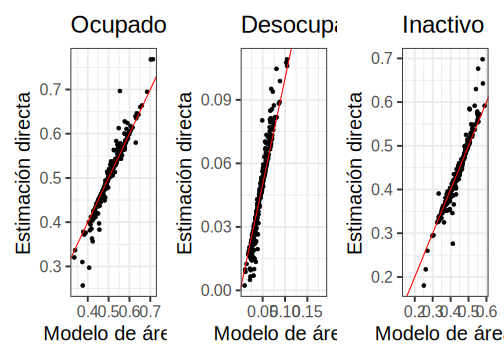
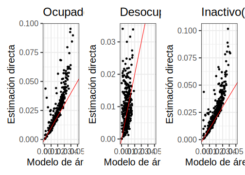
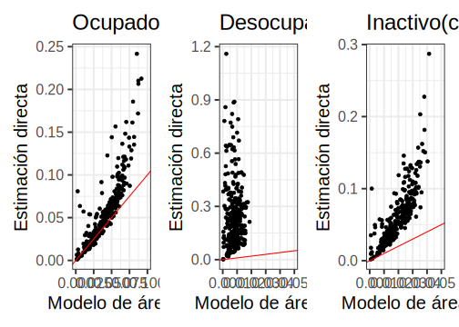
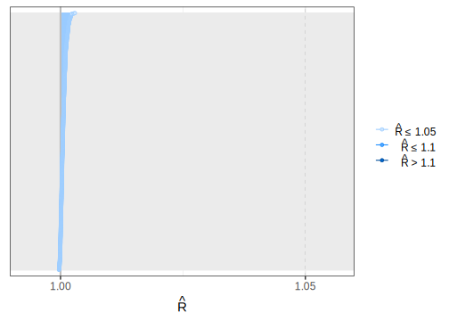

```r
knitr::opts_chunk$set(warning = FALSE, 
                      message = FALSE,
                      cache = TRUE)
library(kableExtra)
```

```
## Warning: package 'kableExtra' was built under R version 4.2.2
```

```r
tba <- function(dat, cap = NA){
  kable(dat,
      format = "html", digits =  4,
      caption = cap) %>% 
     kable_styling(bootstrap_options = "striped", full_width = F)%>%
         kable_classic(full_width = F, html_font = "Arial Narrow")
}
```

# Validación sobre los resultados del modelo de área.

La validación de un modelo es esencial para evaluar su capacidad para predecir de manera precisa y confiable los resultados futuros. En el caso de un modelo de área con respuesta multinomial, la validación se enfoca en medir la precisión del modelo para predecir las diferentes categorías de respuesta. El objetivo principal de la validación es determinar si el modelo es capaz de generalizar bien a datos no vistos y proporcionar predicciones precisas. Esto implica comparar las predicciones del modelo con los datos observados y utilizar métricas de evaluación para medir el rendimiento del modelo. La validación del modelo es esencial para garantizar la calidad de las predicciones y la confiabilidad del modelo para su uso en aplicaciones futuras.

## Lectura de librerías 

  -   La librería *stringr* es una librería de R que proporciona herramientas para manipular y procesar cadenas de caracteres. Esta librería es especialmente útil para limpiar y transformar datos de texto.

  -   La librería *magrittr* es una librería de R que proporciona una sintaxis más legible y fácil de usar para encadenar y componer funciones. Esta librería es especialmente útil para escribir código más limpio y fácil de entender.

  -   La librería *ggplot2* es una herramienta de visualización de datos en R que permite crear gráficos estadísticos personalizados y de alta calidad. Ofrece una amplia variedad de opciones para crear gráficos de barras, gráficos de líneas, gráficos de dispersión, gráficos de cajas, entre otros. Esta librería se destaca por su capacidad para personalizar los gráficos en función de las necesidades del usuario, lo que permite crear gráficos complejos con múltiples capas y características.

  -   La librería *patchwork* es una librería utilizada para crear paneles de visualización personalizados y complejos en R. Ofrece una amplia variedad de opciones para combinar y organizar gráficos, así como para agregar anotaciones y elementos decorativos. Esta librería es especialmente útil para crear paneles de visualización que incluyan varios gráficos y tablas.

  -   La librería *tidyverse* es una colección de paquetes de R que se utilizan para manipular, procesar y visualizar datos de manera eficiente. Incluye varias librerías como `dplyr`, `ggplot2`, `tidyr`, entre otras, que proporcionan herramientas para limpiar, transformar y visualizar datos de manera efectiva.
  
  -   La librería *forcats* es una herramienta de manipulación de factores en R. Proporciona una serie de funciones para trabajar con variables categóricas/factores y manejarlos de manera más eficiente y efectiva.

  -   La librería *cmdstanr* es una librería de R que permite interactuar con el software de modelado Bayesianos CmdStan. Esta librería es especialmente útil para ajustar modelos Bayesianos complejos y realizar inferencia posterior.

  -   La librería *bayesplot* es una librería de visualización de datos que proporciona herramientas para crear gráficos estadísticos y diagnosticar modelos Bayesianos. Esta librería es especialmente útil para explorar la distribución posterior y evaluar la calidad del ajuste del modelo.


```r
library(stringr)
library(magrittr)
library(ggplot2)
library(patchwork)
library(tidyverse)
library(forcats)
library(cmdstanr)
library(bayesplot)
select <- dplyr::select
```

## Lectura de bases de datos

Estas dos líneas de código están leyendo archivos RDS en el directorio especificado. El archivo `indicador_dam.Rds` contiene un conjunto de datos llamado `indicador_dam` que se utilizará para ajustar y validar el modelo. El archivo `dam_pred.rds` contiene datos adicionales para realizar predicciones fuera de la muestra y evaluar el desempeño del modelo.


```r
indicador_dam <- readRDS('01 Modelo de area/CHL/2017/Data/indicador_dam.Rds')
dam_pred <- readRDS('01 Modelo de area/CHL/2017/Data/dam_pred.rds')
```

Además, el siguiente bloque de código establece el nombre del modelo (mod) y crea dos variables que especifican la ubicación del archivo de entrada (infile) y el archivo de salida (out_estimacion) para las estimaciones del modelo. Finalmente, el código utiliza la función `readRDS()` para cargar el modelo ajustado previamente en el archivo de entrada `infile` y asignarlo a la variable `fit`.

```r
mod <- "fit_multinomial_con_covariable"

infile <- paste0("01 Modelo de area/CHL/2017/Data/",mod,".rds")
out_estimacion <- paste0("01 Modelo de area/CHL/2017/Data/estimaciones_",mod,".rds") 

fit <- readRDS(infile)
```

## Estimacion directa 

En estas líneas de código se realiza una selección y transformación de datos a partir del dataset `indicador_dam` que se leyó previamente. Primero, se filtra el dataset para mantener solo las filas en las que el valor de `n_upm` (conteo de unidad primaria de muestreo) es mayor o igual a 2 y donde no haya valores faltantes en la columna `Desocupado_deff`. Esto se logra utilizando la función `filter()` de `dplyr`.

Luego, se define el número de categorías (P) como 3, el número de dominios (D) como el número de filas en el dataset filtrado `indicador_dam1`, y el número de dominios de predicción (D1) como el número de filas en el dataset `dam_pred` que se leyó previamente.

Finalmente, se crea un nuevo dataframe `theta_dir` a partir del `data.frame` filtrado `indicador_dam1`. Este nuevo dataframe contiene la información de `n_desocupado`, `n_ocupado` y `n_inactivo` de cada dominios y la categoría ocupacional de interés (Ocupado, Desocupado e Inactivo).


```r
indicador_dam1 <- indicador_dam  %>% 
  filter(n_upm >= 2 & !is.na(Desocupado_deff)) 
P <- 3 
D <- nrow(indicador_dam1)
D1 <- nrow(dam_pred)
theta_dir <- indicador_dam1 %>%  
  transmute(dam2,
    n = n_desocupado + n_ocupado + n_inactivo,
            Ocupado, Desocupado, Inactivo)
```

Ahora, se obtienen las estimaciones del parámetro $\theta$ a partir del modelo. 


```r
theta_obs <- fit$summary("theta")
theta_pred <- fit$summary("theta_pred")
```

Seguido de esto se organiza la matriz de $\theta$

El código crea dos matrices, `theta_obs_ordenado` y `theta_pred_ordenado`, que contienen las estimaciones medias de los parámetros del modelo de respuesta multinomial con covariables para los datos de observación y predicción, respectivamente. La función `matrix()` se utiliza para dar formato a los datos con una matriz `nrow` x `ncol`, y se asignan nombres de columna apropiados a la matriz resultante utilizando `colnames()`. Luego se convierten las matrices en marcos de datos (`as.data.frame()`) y se unen mediante `full_join()` para crear una única tabla que contenga todas las estimaciones de los parámetros para los datos de observación y predicción, junto con la información del indicador de área (`theta_dir`). El resultado final es un marco de datos llamado `estimaciones_obs`.


```r
theta_obs_ordenado <- matrix(theta_obs$mean, 
                             nrow = D,
                             ncol = P,byrow = FALSE) 

colnames(theta_obs_ordenado) <- c("Ocupado_mod", "Desocupado_mod", "Inactivo_mod")
theta_obs_ordenado%<>% as.data.frame()
theta_obs_ordenado <- cbind(dam2 = indicador_dam1$dam2,
                            theta_obs_ordenado)

theta_pred_ordenado <- matrix(theta_pred$mean, 
                             nrow = D1,
                             ncol = P,byrow = FALSE)

colnames(theta_pred_ordenado) <- c("Ocupado_mod", "Desocupado_mod", "Inactivo_mod")
theta_pred_ordenado%<>% as.data.frame()
theta_pred_ordenado <- cbind(dam2 = dam_pred$dam2, theta_pred_ordenado)


estimaciones_obs <- full_join(theta_dir, 
                              bind_rows(theta_obs_ordenado,theta_pred_ordenado))
```

## Estimación del coeficiente de variación 

Este bloque de código tiene como objetivo calcular la desviación estándar (sd) y el coeficiente de variación (cv) de los parámetros estimados del modelo para las áreas de observación (`theta_obs`) y las áreas de predicción (`theta_pred`). En primer lugar, se convierten los valores de `theta_obs` y `theta_pred` en matrices y se les asignan nombres de columnas correspondientes a los tres estados laborales: _Ocupado_mod_, _Desocupado_mod_ e _Inactivo_mod_. A continuación, se calcula la desviación estándar de cada uno de estos parámetros para las áreas de observación y se crea una nueva matriz `theta_obs_ordenado_sd`. De manera similar, se calcula la desviación estándar de cada parámetro para las áreas de predicción y se crea una matriz `theta_pred_ordenado_sd`. Posteriormente, se calcula el coeficiente de variación para cada parámetro en las áreas de observación y predicción, dividiendo la desviación estándar entre la media de cada parámetro y se crean las matrices `theta_obs_ordenado_cv` y `theta_pred_ordenado_cv`, respectivamente. Finalmente, se combinan todas las matrices en una sola llamada `estimaciones_obs` mediante la función `cbind()`.


```r
theta_obs_ordenado_sd <- matrix(theta_obs$sd, 
                             nrow = D,
                             ncol = P,byrow = FALSE) 

colnames(theta_obs_ordenado_sd) <- c("Ocupado_mod_sd", "Desocupado_mod_sd", "Inactivo_mod_sd")
theta_obs_ordenado_sd%<>% as.data.frame()
theta_obs_ordenado_sd <- cbind(dam2 = indicador_dam1$dam2,
                            theta_obs_ordenado_sd)
theta_obs_ordenado_cv <- theta_obs_ordenado_sd[,-1]/theta_obs_ordenado[,-1]

colnames(theta_obs_ordenado_cv) <- c("Ocupado_mod_cv", "Desocupado_mod_cv", "Inactivo_mod_cv")

theta_obs_ordenado_cv <- cbind(dam2 = indicador_dam1$dam2,
                               theta_obs_ordenado_cv)

theta_pred_ordenado_sd <- matrix(theta_pred$sd, 
                              nrow = D1,
                              ncol = P,byrow = FALSE)

colnames(theta_pred_ordenado_sd) <- c("Ocupado_mod_sd", "Desocupado_mod_sd", "Inactivo_mod_sd")
theta_pred_ordenado_sd%<>% as.data.frame()
theta_pred_ordenado_sd <- cbind(dam2 = dam_pred$dam2, theta_pred_ordenado_sd)

theta_pred_ordenado_cv <- theta_pred_ordenado_sd[,-1]/theta_pred_ordenado[,-1]

colnames(theta_pred_ordenado_cv) <- c("Ocupado_mod_cv", "Desocupado_mod_cv", "Inactivo_mod_cv")

theta_pred_ordenado_cv <- cbind(dam2 = dam_pred$dam2, theta_pred_ordenado_cv)
```

## Consolidando los resultados en una base de datos. 

En este fragmento de código se están uniendo los data frames `theta_obs_ordenado`, `theta_obs_ordenado_sd` y `theta_obs_ordenado_cv` mediante la función `full_join()`, y se está almacenando el resultado en el data frame `theta_obs_ordenado`. Lo mismo se está realizando con los data frames `theta_pred_ordenado`, `theta_pred_ordenado_sd` y `theta_pred_ordenado_cv`, almacenando el resultado en el data frame `theta_pred_ordenado`. Posteriormente, se está uniendo el data frame `theta_obs_ordenado` y `theta_pred_ordenado` con el data frame `indicador_dam1`, donde se están guardando las estimaciones en el data frame `estimaciones_obs`.


```r
############# uniendo las estimaciones, sd, cv #########
theta_obs_ordenado <- full_join(theta_obs_ordenado,theta_obs_ordenado_sd) %>% 
  full_join(theta_obs_ordenado_cv)

theta_pred_ordenado <- full_join(theta_pred_ordenado,theta_pred_ordenado_sd) %>% 
  full_join(theta_pred_ordenado_cv)


estimaciones_obs <- full_join(indicador_dam1,
                              bind_rows(theta_obs_ordenado, theta_pred_ordenado))
```

## Gráfica comparativa entre las estimación directa y la estimación resultante del modelo 

### Estimación puntual 

El código genera tres gráficos en un formato de **mosaico** con _p_ocupado_, _p_Desocupado_ y _p_Inactivo_. Cada gráfico muestra la relación entre la variable dependiente de la encuesta original y la variable dependiente estimada por el modelo de área.

Cada gráfico utiliza los datos de `estimaciones_obs` y utiliza `geom_point()` para agregar puntos que representan la estimación directa de la variable dependiente (y) versus la estimación por el modelo de área (x). También utiliza `geom_abline()` para agregar una línea roja con una pendiente de 1 e intercepto de 0, lo que representa una relación perfecta entre la variable dependiente original y la variable dependiente estimada.

Finalmente, cada gráfico utiliza `labs` para agregar etiquetas de eje y títulos de gráfico. El tema `theme_bw()` establece el tema en blanco y negro con un tamaño de fuente de 20 puntos. Los tres gráficos se combinan usando el operador `|` para crear un **mosaico**.


```r
p_ocupado <- ggplot(data = estimaciones_obs, 
       aes(y = Ocupado, 
           x = Ocupado_mod
           )) +
  geom_point() + 
  geom_abline(slope = 1, intercept = 0, col = "red")  +
  labs(x = "Modelo de área",
                      y = "Estimación directa" , 
       title = "Ocupado")+
  theme_bw(base_size = 20)

p_Desocupado <- ggplot(data = estimaciones_obs, 
                    aes(y = Desocupado, 
                        x = Desocupado_mod
                    )) +
  geom_point() + 
  geom_abline(slope = 1, intercept = 0, col = "red")  +
  labs(x = "Modelo de área",
       y = "Estimación directa", 
       title = "Desocupado")+
  theme_bw(base_size = 20)

p_Inactivo <- ggplot(data = estimaciones_obs, 
                       aes(y = Inactivo, 
                           x = Inactivo_mod
                       )) +
  geom_point() + 
  geom_abline(slope = 1, intercept = 0, col = "red")  +
  labs(x = "Modelo de área",
       y = "Estimación directa" , 
       title = "Inactivo")+
  theme_bw(base_size = 20)

p_ocupado|p_Desocupado|p_Inactivo
```



### Error estándar. 

  1.    Crea tres gráficos de dispersión utilizando el paquete ggplot2.
  
  2.    Cada gráfico muestra la relación entre la estimación directa y la estimación del modelo de área para cada una de las tres categorías de ocupación: Ocupado, Desocupado e Inactivo.
  
  3.    Se utiliza la función `geom_point()` para agregar los puntos en el gráfico y `geom_abline()` para dibujar una línea de referencia en cada gráfico.
  
  4.    Se establece la etiqueta de los ejes `x` e `y` y el título de cada gráfico utilizando la función `labs()`.
  
  5.    Se ajusta el tema del gráfico utilizando la función `theme_bw()`.
  
Finalmente, se combinan los tres gráficos utilizando el operador `+` y se limita el rango del eje `x` para cada gráfico utilizando la función `xlim()`.


```r
##########################################
## Comparación de los error estándar  
p_ocupado <- ggplot(data = estimaciones_obs, 
                    aes(y = Ocupado_se, 
                        x = Ocupado_mod_sd
                    )) +
  geom_point() + 
  geom_abline(slope = 1, intercept = 0, col = "red")  +
  labs(x = "Modelo de área",
       y = "Estimación directa" , 
       title = "Ocupado (se)")+
  theme_bw(base_size = 20)

p_Desocupado <- ggplot(data = estimaciones_obs, 
                       aes(y = Desocupado_se, 
                           x = Desocupado_mod_sd
                       )) +
  geom_point() + 
  geom_abline(slope = 1, intercept = 0, col = "red")  +
  labs(x = "Modelo de área",
       y = "Estimación directa", 
       title = "Desocupado (se)")+
  theme_bw(base_size = 20)

p_Inactivo <- ggplot(data = estimaciones_obs, 
                     aes(y = Inactivo_se, 
                         x = Inactivo_mod_sd
                     )) +
  geom_point() + 
  geom_abline(slope = 1, intercept = 0, col = "red")  +
  labs(x = "Modelo de área",
       y = "Estimación directa" , 
       title = "Inactivo(se)")+
  theme_bw(base_size = 20)

p_ocupado + xlim(0,0.05)|
p_Desocupado  + xlim(0,0.05)|
p_Inactivo +  xlim(0,0.05)
```



### Coeficiente de varianción. 

Este código utiliza el paquete `ggplot2` en R para crear tres gráficas que comparan los coeficientes de variación (cv) estimado con las estimaciones obtenidas mediante modelos de áreas para tres categorías de empleo: ocupados, desocupados e inactivos. Las gráficas muestran la relación entre la estimación directa del  y la estimación del modelo de área, donde la línea roja representa una línea diagonal perfecta. Si los puntos están cerca de la línea roja, significa que la estimación del modelo de área es similar a la estimación directa. 


```r
##########################################
## Comparación de los cv  
p_ocupado <- ggplot(data = estimaciones_obs, 
                    aes(y = Ocupado_se/Ocupado, 
                        x = Ocupado_mod_cv
                    )) +
  geom_point() + 
  geom_abline(slope = 1, intercept = 0, col = "red")  +
  labs(x = "Modelo de área",
       y = "Estimación directa" , 
       title = "Ocupado (cv)")+
  theme_bw(base_size = 20)

p_Desocupado <- ggplot(data = estimaciones_obs, 
                       aes(y = Desocupado_se/Desocupado, 
                           x = Desocupado_mod_sd
                       )) +
  geom_point() + 
  geom_abline(slope = 1, intercept = 0, col = "red")  +
  labs(x = "Modelo de área",
       y = "Estimación directa", 
       title = "Desocupado(cv)")+
  theme_bw(base_size = 20)

p_Inactivo <- ggplot(data = estimaciones_obs, 
                     aes(y = Inactivo_se/Inactivo, 
                         x = Inactivo_mod_sd
                     )) +
  geom_point() + 
  geom_abline(slope = 1, intercept = 0, col = "red")  +
  labs(x = "Modelo de área",
       y = "Estimación directa" , 
       title = "Inactivo(cv)")+
  theme_bw(base_size = 20)

p_ocupado + xlim(0,0.1)|
  p_Desocupado  + xlim(0,0.05)|
  p_Inactivo +  xlim(0,0.05)
```



Este código se utiliza para realizar una validación cruzada predictiva (PPC, por sus siglas en inglés) en un modelo estadístico que utiliza el paquete `bayesplot`. Primero, se establece un esquema de color para los gráficos utilizando la función `color_scheme_set()` y se configura un tema visual utilizando la función `theme_set()`. Luego, se extraen las muestras posteriores del parámetro `theta` del ajuste del modelo utilizando la función `fit$draws()`. Se seleccionan al azar 100 filas de estas muestras posteriores y se extraen los valores correspondientes a las tres categorías de empleo: _Ocupado_, _Desocupado_ e _Inactivo_. Se calcula el PPC para cada categoría de empleo utilizando la función `ppc_dens_overlay()` y se superponen las densidades estimadas a partir de los datos reales y los valores predichos para visualizar la bondad del ajuste del modelo.


```r
### Gráficos de los ppc 
color_scheme_set("brightblue")
theme_set(theme_bw(base_size = 15))
y_pred_B <- fit$draws(variables = "theta", 
                      format = "matrix")
rowsrandom <- sample(nrow(y_pred_B), 100)

theta_1<-  grep(pattern = "1]",x = colnames(y_pred_B),value = TRUE)
theta_2<-  grep(pattern = "2]",x = colnames(y_pred_B),value = TRUE)
theta_3<-  grep(pattern = "3]",x = colnames(y_pred_B),value = TRUE)
y_pred1 <- y_pred_B[rowsrandom,theta_1 ]
y_pred2 <- y_pred_B[rowsrandom,theta_2 ]
y_pred3 <- y_pred_B[rowsrandom,theta_3 ]

ppc_dens_overlay(y = as.numeric(theta_dir$Ocupado), y_pred1)/
  ppc_dens_overlay(y = as.numeric(theta_dir$Desocupado), y_pred2)/
  ppc_dens_overlay(y = as.numeric(theta_dir$Inactivo), y_pred3)
```


### Convergencia de las cadenas

El código `mcmc_rhat(theta_obs$rhat)` valida la convergencia de las cadenas de la simulación de Monte Carlo Markov Chain (MCMC) en el objeto `theta_obs`. En particular, la función `mcmc_rhat` calcula el estadístico R-hat para cada parámetro de la cadena. El estadístico R-hat es una medida de la convergencia de la cadena MCMC y se utiliza para verificar si la simulación ha convergido. Si todos los valores de R-hat son cercanos a 1, entonces se considera que la cadena ha convergido y se puede confiar en los resultados de la simulación. Si hay valores que son mucho mayores que 1, entonces es posible que la simulación no haya convergido y se deben tomar medidas para solucionar el problema, como aumentar el número de iteraciones de la simulación.


```r
mcmc_rhat(theta_obs$rhat)
```



Por ultimo se guardan los resultados obtenidos. 


```r
saveRDS(object = estimaciones_obs, file = out_estimacion)
```

