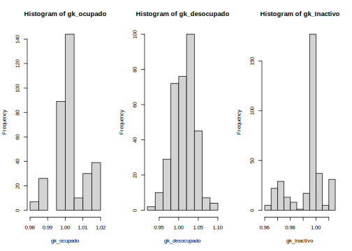

```r
knitr::opts_chunk$set(warning = FALSE, 
                      message = FALSE,
                      cache = TRUE)
library(kableExtra)
```

```
## Warning: package 'kableExtra' was built under R version 4.2.2
```

```r
tba <- function(dat, cap = NA){
  kable(dat,
      format = "html", digits =  4,
      caption = cap) %>% 
     kable_styling(bootstrap_options = "striped", full_width = F)%>%
         kable_classic(full_width = F, html_font = "Arial Narrow")
}
```

# Estimaciones ajustadas por Benchmark

## Lectura de librerías 


```r
library(survey)
library(tidyverse)
library(srvyr)
library(TeachingSampling)
library(haven)
library(sampling)
```

# Lectura de las bases de datos 


```r
encuesta <- readRDS("01 Modelo de area/CHL/2017/Data/encuesta_2017.Rds")
```

## Parametrizando el código

```r
mod <- "fit_multinomial_con_covariable"

infile <- paste0("01 Modelo de area/CHL/2017/Data/estimaciones_",mod,".rds") 
out_estimacion <- paste0("01 Modelo de area/CHL/2017/Data/estimaciones_Bench_",mod,".rds") 

estimaciones <- readRDS(infile)
```

## Conteos agregados por dam y dam2 


```r
conteo_pp_dam <- readRDS("01 Modelo de area/CHL/2017/Data/censo_mrp.rds") %>%
  filter(edad > 1)  %>% 
  group_by(dam = depto, dam2 = mpio) %>% 
  summarise(pp_dam2 = sum(n)) %>% 
  add_tally(wt = pp_dam2, name = "pp_dam")
```

## Tranformando variables de la encuesta. 


```r
length_upm <- max(nchar(encuesta[["_upm"]]))
length_estrato <- max(nchar(encuesta[["_estrato"]]))

encuesta <-
  encuesta %>%
  transmute(
    dam = as_factor(dam_ee,levels  = "values"),
    dam = str_pad(string =dam, width = 2, pad = "0"),
    nombre_dam = as_factor(dam_ee,levels  = "labels"),
    upm = str_pad(string = `_upm`, width = length_upm, pad = "0"),
    estrato = str_pad(string = `_estrato`, width = length_estrato , pad = "0"),
    fep = `_fep`, 
    empleo = condact3
  )
```

## Creando el objeto diseño 


```r
options(survey.lonely.psu= 'adjust' )
diseno <- encuesta %>%
  as_survey_design(
    strata = estrato,
    ids = upm,
    weights = fep,
    nest=T
  )
```

## Estimado el indicador  
 

```r
indicador_agregado <-
  diseno %>% group_by_at("dam") %>% 
  filter(empleo %in% c(1:3)) %>%
  summarise(
    Ocupado = survey_ratio(numerator = (empleo == 1), 
                           denominator = 1 ),
    Desocupado = survey_ratio(numerator =( empleo == 2),denominator = 1
                             
    ),
    Inactivo = survey_ratio(numerator =  (empleo == 3), denominator = 1
                           
    )
  ) %>% select(dam,Ocupado,Desocupado, Inactivo)
```

## Organizando las estimaciones directas agregadas. 


```r
temp <-
  gather(indicador_agregado, key = "agregado", 
         value = "estimacion", -dam) %>%
  mutate(nombre = paste0("dam_", dam,"_", agregado))

Razon_empleo <- setNames(temp$estimacion, temp$nombre)
```

## Benchmarking

```r
names_cov <-  "dam" 
estimaciones_mod <- estimaciones %>% transmute(
  dam = substr(dam2,1,2),
  dam2,Ocupado_mod,Desocupado_mod,Inactivo_mod) %>% 
  inner_join(conteo_pp_dam ) %>% 
  mutate(wi = pp_dam2/pp_dam)
```

Los valores no suman 1 dado que se elimina la antartida. 

```r
estimaciones_mod %>% group_by(dam) %>% summarise(wi = sum(wi))
```

```
## # A tibble: 16 × 2
##    dam      wi
##    <chr> <dbl>
##  1 01    1    
##  2 02    1    
##  3 03    1    
##  4 04    1    
##  5 05    1    
##  6 06    1    
##  7 07    1    
##  8 08    1    
##  9 09    1    
## 10 10    1    
## 11 11    1    
## 12 12    0.999
## 13 13    1    
## 14 14    1    
## 15 15    1    
## 16 16    1
```

## Seleccionado variables


```r
estimaciones_mod %<>%
  fastDummies::dummy_cols(select_columns = names_cov,
                          remove_selected_columns = FALSE)
```

## creando las dummys 
 

```r
Xdummy <- estimaciones_mod %>% select(matches("dam_")) %>% 
  mutate_at(vars(matches("_\\d")) ,
            list(Ocupado = function(x) x*estimaciones_mod$Ocupado_mod,
                 Desocupado = function(x) x*estimaciones_mod$Desocupado_mod,
                 Inactivo = function(x) x*estimaciones_mod$Inactivo_mod)) %>% 
  select((matches("Ocupado|Desocupado|Inactivo")))
```

## Validación de la concordancia de los nombre 


```r
colnames(Xdummy) == names(Razon_empleo)
```

```
##  [1] TRUE TRUE TRUE TRUE TRUE TRUE TRUE TRUE TRUE TRUE TRUE TRUE TRUE TRUE TRUE
## [16] TRUE TRUE TRUE TRUE TRUE TRUE TRUE TRUE TRUE TRUE TRUE TRUE TRUE TRUE TRUE
## [31] TRUE TRUE TRUE TRUE TRUE TRUE TRUE TRUE TRUE TRUE TRUE TRUE TRUE TRUE TRUE
## [46] TRUE TRUE TRUE
```

```r
data.frame(Modelo = colSums(Xdummy*estimaciones_mod$wi),
Estimacion_encuesta = Razon_empleo)
```

```
##                       Modelo Estimacion_encuesta
## dam_01_Ocupado    0.57696754          0.58485184
## dam_02_Ocupado    0.55306546          0.55614508
## dam_03_Ocupado    0.52430985          0.52457151
## dam_04_Ocupado    0.47094481          0.46969196
## dam_05_Ocupado    0.51749483          0.51762640
## dam_06_Ocupado    0.52125693          0.52346473
## dam_07_Ocupado    0.51514726          0.51437848
## dam_08_Ocupado    0.48432594          0.47706114
## dam_09_Ocupado    0.49177321          0.49032170
## dam_10_Ocupado    0.53122452          0.53233998
## dam_11_Ocupado    0.60816182          0.61801704
## dam_12_Ocupado    0.59155423          0.59231614
## dam_13_Ocupado    0.59449276          0.60401104
## dam_14_Ocupado    0.50671532          0.50601851
## dam_15_Ocupado    0.50983847          0.50997160
## dam_16_Ocupado    0.50083251          0.50230442
## dam_01_Desocupado 0.04760872          0.04865991
## dam_02_Desocupado 0.05190692          0.05561626
## dam_03_Desocupado 0.05080028          0.05318520
## dam_04_Desocupado 0.06240013          0.06401381
## dam_05_Desocupado 0.05464411          0.05621727
## dam_06_Desocupado 0.04160122          0.04114200
## dam_07_Desocupado 0.03990747          0.03870429
## dam_08_Desocupado 0.05770353          0.06006990
## dam_09_Desocupado 0.04815869          0.05009673
## dam_10_Desocupado 0.04126619          0.04105318
## dam_11_Desocupado 0.03429950          0.03257809
## dam_12_Desocupado 0.03846971          0.03760152
## dam_13_Desocupado 0.05184454          0.05278045
## dam_14_Desocupado 0.04587066          0.04790803
## dam_15_Desocupado 0.06635795          0.06758221
## dam_16_Desocupado 0.04297262          0.04368049
## dam_01_Inactivo   0.37542374          0.36648824
## dam_02_Inactivo   0.39502762          0.38823866
## dam_03_Inactivo   0.42488987          0.42224330
## dam_04_Inactivo   0.46665506          0.46629423
## dam_05_Inactivo   0.42786106          0.42615633
## dam_06_Inactivo   0.43714184          0.43539327
## dam_07_Inactivo   0.44494528          0.44691723
## dam_08_Inactivo   0.45797052          0.46286896
## dam_09_Inactivo   0.46006810          0.45958157
## dam_10_Inactivo   0.42750928          0.42660684
## dam_11_Inactivo   0.35753868          0.34940487
## dam_12_Inactivo   0.36901740          0.37008234
## dam_13_Inactivo   0.35366270          0.34320851
## dam_14_Inactivo   0.44741402          0.44607346
## dam_15_Inactivo   0.42380358          0.42244619
## dam_16_Inactivo   0.45619487          0.45401509
```

## Idenficando valores por cátegoria.


```r
names_ocupado <- grep(pattern = "_O", x = colnames(Xdummy),value = TRUE)
names_descupados <- grep(pattern = "_D", x = colnames(Xdummy),value = TRUE)
names_inactivo <- grep(pattern = "_I", x = colnames(Xdummy),value = TRUE)
```

### Ocupado 

```r
gk_ocupado <- calib(Xs = Xdummy[,names_ocupado], 
            d =  estimaciones_mod$wi,
            total = Razon_empleo[names_ocupado],
            method="linear",max_iter = 5000,) 

checkcalibration(Xs = Xdummy[,names_ocupado], 
                 d =estimaciones_mod$wi,
                 total = Razon_empleo[names_ocupado],
                 g = gk_ocupado,)
```

```
## $message
## [1] "the calibration is done"
## 
## $result
## [1] TRUE
## 
## $value
## [1] 1e-06
```

```r
summary(gk_ocupado)
```

```
##    Min. 1st Qu.  Median    Mean 3rd Qu.    Max. 
##  0.9827  0.9985  1.0005  1.0021  1.0043  1.0191
```

### Desocupado

```r
gk_desocupado <- calib(Xs = Xdummy[,names_descupados], 
                    d =  estimaciones_mod$wi,
                    total = Razon_empleo[names_descupados],
                    method="linear",max_iter = 5000,) 

checkcalibration(Xs = Xdummy[,names_descupados], 
                 d =estimaciones_mod$wi,
                 total = Razon_empleo[names_descupados],
                 g = gk_desocupado,)
```

```
## $message
## [1] "the calibration is done"
## 
## $result
## [1] TRUE
## 
## $value
## [1] 1e-06
```

```r
summary(gk_desocupado)
```

```
##    Min. 1st Qu.  Median    Mean 3rd Qu.    Max. 
##  0.9387  0.9946  1.0171  1.0143  1.0317  1.0983
```

## Inactivo

```r
gk_Inactivo <- calib(Xs = Xdummy[,names_inactivo], 
                    d =  estimaciones_mod$wi,
                    total = Razon_empleo[names_inactivo],
                    method="linear",max_iter = 5000,) 

checkcalibration(Xs = Xdummy[,names_inactivo], 
                 d =estimaciones_mod$wi,
                 total = Razon_empleo[names_inactivo],
                 g = gk_Inactivo,)
```

```
## $message
## [1] "the calibration is done"
## 
## $result
## [1] TRUE
## 
## $value
## [1] 1e-06
```

```r
summary(gk_Inactivo)
```

```
##    Min. 1st Qu.  Median    Mean 3rd Qu.    Max. 
##  0.9610  0.9942  0.9963  0.9935  0.9992  1.0137
```

validando los $gk$'s de forma visual. 


```r
par(mfrow = c(1,3))
hist(gk_ocupado)
hist(gk_desocupado)
hist(gk_Inactivo)
```



### Creando las estimaciones Benchmark


```r
estimacionesBench <- estimaciones_mod %>%
  mutate(gk_ocupado, gk_desocupado, gk_Inactivo) %>%
  transmute(
    dam,
    dam2,
    wi,gk_ocupado, gk_desocupado, gk_Inactivo,
    Ocupado_Bench = Ocupado_mod*gk_ocupado,
    Desocupado_Bench = Desocupado_mod*gk_desocupado,
    Inactivo_Bench = Inactivo_mod*gk_Inactivo
  ) 
#############################33
```

Comparando resultados del Benchmarking


```r
estimacionesBench %>%
  group_by(dam) %>% 
  summarise(Ocupado_Bench = sum(wi*Ocupado_Bench),
            Desocupado_Bench = sum(wi*Desocupado_Bench),
            Inactivo_Bench = sum(wi*Inactivo_Bench)) %>% 
  inner_join(indicador_agregado) %>% 
  View()

estimaciones <- inner_join(estimaciones,estimacionesBench)
```

Ordenando la base con las estimaciones directas y  predichas


```r
saveRDS(object = estimaciones, file = out_estimacion)
```

