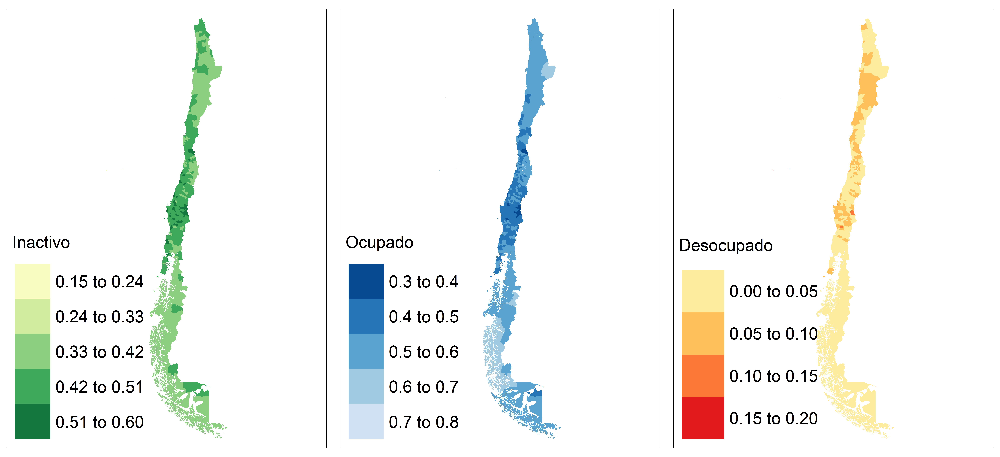

```r
knitr::opts_chunk$set(warning = FALSE, 
                      message = FALSE,
                      cache = TRUE)
library(kableExtra)
```

```
## Warning: package 'kableExtra' was built under R version 4.2.2
```

```r
tba <- function(dat, cap = NA){
  kable(dat,
      format = "html", digits =  4,
      caption = cap) %>% 
     kable_styling(bootstrap_options = "striped", full_width = F)%>%
         kable_classic(full_width = F, html_font = "Arial Narrow")
}
```

# Mapas de resultados

## Lectura de librerías 

  -   `tidyverse`: colección de paquetes de R diseñados para ciencia de datos. Incluye, entre otros, `ggplot2`, `dplyr`, `tidyr`.

  -   `magrittr`: paquete que ofrece una sintaxis para encadenar operaciones en R (`%>%`).
  
  -   `patchwork`: paquete para crear visualizaciones complejas combinando múltiples gráficos en una sola trama.
  
  -   `sp`: paquete para trabajar con datos espaciales (análisis espacial, geoprocesamiento, etc.).

  `sf`: paquete para trabajar con datos geoespaciales (formato Simple Features).
  
  -   `tmap`: paquete para crear mapas temáticos en R.
  -   `RColorBrewer`: paquete que proporciona paletas de colores útiles para visualizaciones.
  
  -   `maptools`: paquete para leer y manipular datos geoespaciales.

  -   `DescTools`: paquete con funciones útiles para estadística descriptiva.


```r
library(tidyverse)
library(magrittr)
library(patchwork)
library(sp)
library(sf)
library(tmap)
library(RColorBrewer)
library(maptools)
library(DescTools)
```

## Parametrizando el código

Este código lee los resultados del modelo `fit_multinomial_con_covariable` y almacena la ubicación de los archivos de salida para tres gráficos en formato PDF y una imagen en formato PNG. Además, almacena los resultados del modelo en un objeto llamado "estimaciones".


```r
mod <- "fit_multinomial_con_covariable"

infile <- paste0("01 Modelo de area/CHL/2017/Data/estimaciones_Bench_",mod,".rds") 
outOcupado <-  paste0("01 Modelo de area/CHL/2017/Output/Ocupados_",mod,".pdf") 
outDesocupado <-  paste0("01 Modelo de area/CHL/2017/Output/Desocupados_",mod,".pdf") 
outInactivo <-  paste0("01 Modelo de area/CHL/2017/Output/Inactivo_",mod,".pdf") 
outMosaico <-  paste0("01 Modelo de area/CHL/2017/Output/Mosaico_",mod,".png") 

estimaciones <- readRDS(infile)
```

## Lectura de shapefile 


```r
## leer shape del pais
ShapeSAE <- read_sf("01 Modelo de area/CHL/2017/ShapeDeptoCHL/comunas.shp")
ShapeSAE %<>% mutate(dam2 = str_pad(
  string = cod_comuna,
  width = 5,
  pad = "0"
),
dam = str_pad(
  string = codregion,
  width = 2,
  pad = "0"
)
) %>% 
  filter(dam != "00", !dam2 %in% c("05201", "13603"))

# 13603: Isla de Isla de Maipo
# 05201: Isla de Pascua
# ShapeSAE %>% as.data.frame() %>% select(dam2,dam,Comuna) %>% 
#   view()
```

## Definición del mapa con `tmap`


```r
#########################################
P1_empleo <- tm_shape(ShapeSAE %>%
                           inner_join(estimaciones))
brks_ocupado <- seq(0.3,0.8,0.1)
brks_desocupado <- seq(0,0.2,0.05)
brks_inactivo <- seq(0.15,0.6, 0.09)
```

### Creando mapa de ocupados 

```r
Mapa_ocupado <-
  P1_empleo +
  tm_fill("Ocupado_mod",
          breaks = brks_ocupado,
          title = "Ocupado",
          palette = "-Blues") +
  tm_layout(
    legend.only = FALSE,
    legend.height = -0.5,
    legend.width = -0.5,
    asp = 1.5,
    legend.text.size = 3,
    legend.title.size = 3
  )
```

Guardando el mapa de coupados


```r
tmap_save(
  Mapa_ocupado,
  outOcupado,
  width = 6920,
  height = 4080,
  asp = 0
)
```

### Creando mapa de desocupados 


```r
Mapa_desocupado <-
  P1_empleo + tm_fill(
    "Desocupado_mod",
    breaks = brks_desocupado,
    title =  "Desocupado",
    palette = "YlOrRd"
  ) + tm_layout( 
    legend.only = FALSE,
    legend.height = -0.5,
    legend.width = -0.5,
    asp = 1.5,
    legend.text.size = 3,
    legend.title.size = 3)
```

Guardando el mapa de desocupado

```r
tmap_save(
  Mapa_desocupado,
  outDesocupado,
  width = 6920,
  height = 4080,
  asp = 0
)
```

### Creando mapa de inactivo


```r
Mapa_Inactivo <-
  P1_empleo + tm_fill(
      "Inactivo_mod",
    title =  "Inactivo",
    breaks = brks_inactivo,
    palette = "YlGn"
  ) + tm_layout( 
    legend.only = FALSE,
    legend.height = -0.5,
    legend.width = -0.5,
    asp = 1.5,
    legend.text.size = 3,
    legend.title.size = 3)
```
Guardando el mapa de inactivo


```r
tmap_save(
  Mapa_Inactivo,
  outInactivo,
  width = 6920,
  height = 4080,
  asp = 0
)
```

creando un mosaico. 


```r
mosaico <- tmap_arrange(Mapa_Inactivo, Mapa_ocupado,Mapa_desocupado,ncol = 3,
             nrow = 1 )
```


guardar mosaico 

```r
tmap_save(
  mosaico,
  outMosaico,
  width = 8920,
  height = 4080,
  asp = 0
)
```


```r

```


